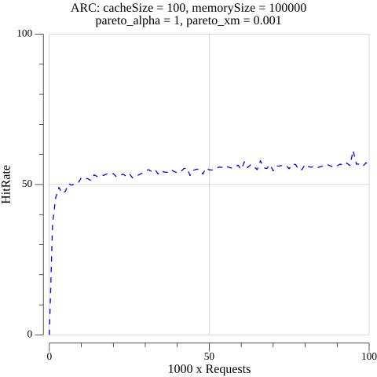
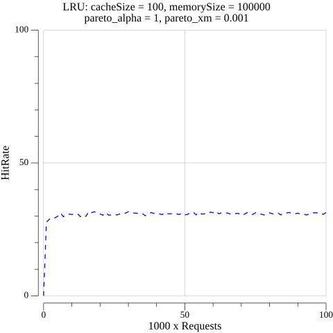

> **Amir Mokhammed-Ali**\
> **COS 316**
>
> **Project Description.**
>
> In this project, I am implementing a cache management policy named ARC
> (Adaptive Replacement Cache) that has several important advantages
> over the LRU or FIFO caches. Firstly, ARC continually revises its
> assumptions about the workload and dynamically balances between
> recency and frequency components, thereby combining the advantages of
> LFU and LRU. Secondly, ARC is scan resistant. In other words, it
> allows one-time sequential requests to pass through without polluting
> the cache. Thirdly, ARC stores metadata about recently evicted
> entries, so that the cache knows where to reinsert a value that was
> recently evicted. These facts make ARC more efficient than LRU, LFU,
> or FIFO, since they do not adapt to the workload or consider recency
> and frequency at the same time.
>
> **Design Overview.**
>
> ARC consists of 2 LRU caches of equal capacities. The first cache (L1)
> stores elements that have been recently added to the cache and the
> second cache (L2) stores elements that have been accessed at least
> twice in a short period of time. An important property is that the
> total size of both caches never exceeds the capacity of ARC, although
> the distribution of resources among the two can vary adaptively in
> relation to the workload (more about it later).
>
> While two LRU caches are sufficient to implement ARC, I decided to
> simplify the design and lay bare its idea by dividing each into two
> smaller caches. The "top" parts (T1, T2) of each cache store real
> entries and the "bottom" parts (B1, B2) store metadata about recently
> evicted entries. The idea of the bottom cache is to avoid situations
> where we "forget" about a recently evicted cache block, so we cache
> the keys associated with the blocks in B1 or B2 depending on which top
> cache evicted them. As a result, we put it right into T2 instead of T1
> the next time it is brought into the cache.
>
> The distribution of resources among two caches is handled by the cache
> in response to the incoming requests. For example, if a user asks for
> a recently evicted block in B1, the cache adapts by increasing the
> capacity of T1 and decreasing the capacity of T2 (and vice versa). The
> magnitude of the increment - the learning rate - can be chosen
> depending on the context.
>
> The interface of the ARC consists of the following methods:\
> 1. Get(key) returns (value, bool) - returns the value associated with
> the key or false, if the value does not exist.
>
> 2\. Set(key, value) returns (bool) - associates the value with the
> given key, possibly evicting values to make room. Returns true if the
> binding was successful and false otherwise. Evicts blocks from the top
> if the top is full. The metadata about evicted blocks is added to one
> of the bottom caches.
>
> 3\. Remove(key) returns (bool) - removes and returns the value
> associated with the given key, if it exists. Otherwise returns false.
> The operation does not add metadata about the removed block into any
> of the bottom caches.
4. Len() returns int - returns the numbers of bindings in the cache.
5. MaxStorage() returns int - returns the maximum number of bindings the cache can store
6. RemainingStorage() returns int - returns the number of free slots in the cache.7. Stats() returns Stats - returns statistics with the number of hits and misses over the cache’s
lifetime.
>
> It is important to note that the API of my implementation of ARC is
> different from what was in the assignment. The ARC was proposed to
> solve the problem of demand paging scenarios with uniform page sizes.
> An example of this scenario would be virtual memory. Consequently, my
> cache is not dealing with variable-sized key-value pairs, but with
> fixed size key-page pairs. For the same reason I do not take into
> consideration the size of a key in Set(). On the hardware level, the
> key is a deterministic function of the value (e.g. index bits of the
> address), so the size of a key is sufficiently small compared to the
> size of a page and it constitutes an overhead. Such caching is also
> prevalent in other scenarios, such as caching the fixed-size video
> blocks on a CDN server.
>
> Paging is implemented in page.go. To create a page, one should ideally
> create a PageAllocator first and then specify the size of the page in
> bytes and call the Allocate() method.
>
> **Testing Methodology.**
>
> Arc_test.go file consists of:\
> 1) **Blackbox testing** of the cache interface. Unit and stress tests
> of cache methods. I am also testing the qualities of ARC that
> constitute its core advantages in comparison to FIFO and LRU, such as
> scan-resistance.
>
> **2) Simulation.** I use Pareto distribution to simulate the cache
> functionality in an environment similar to the real world. (More about
> Pareto in the Outcomes section)
>
> **Outcome.**
>
> I've implemented a tool for testing ARC and comparing its performance
> to LRU. It simulates memory and cache of customizable sizes and
> calculates hitrates as a function of the number of requests (fig.1.
> and fig.2. page 3). The caching simulator relies on a Pareto (Zipf)
> distribution. It gradually increments the load to a cache reaching up
> to 10\^5 requests. The tutorial on how to use the simulator is
> explained in the video (set -plot=true for the simulator to draw a
> plot).
>
> For a specific set of conditions, the figures show that while LRU
> average hit rate is around 30%, ARC average hit rate is around 50-60%,
> which is almost twice more effective. This can be explained by the
> fact that Pareto distribution tends to favor a small number of memory
> pages that make it to the T2 and do not get evicted by an unpopular
> memory pages (resembling, thereby, real-life context of\
> caching).Additionally, given that ARC adapts to incoming workload by
> changing the ratio of T1 and T2 capacities, popular entries do not
> frequently evict other popular entries from the T2 and even if they
> do, the cache remembers that the evicted page is used frequently.
> Consequently, it makes sense that ARC would be better suited for
> caching data than LRU in different scenarios.

+-----------------------------------+-----------------------------------+
| > {width="3.9375in" | > Fig. 2. LRU Performance         |
| > height="3.9375in"}              |                                   |
| >                                 |                                   |
| > {width="3.9583333333333335in" |                                   |
| > height="3.9583333333333335in"}  |                                   |
